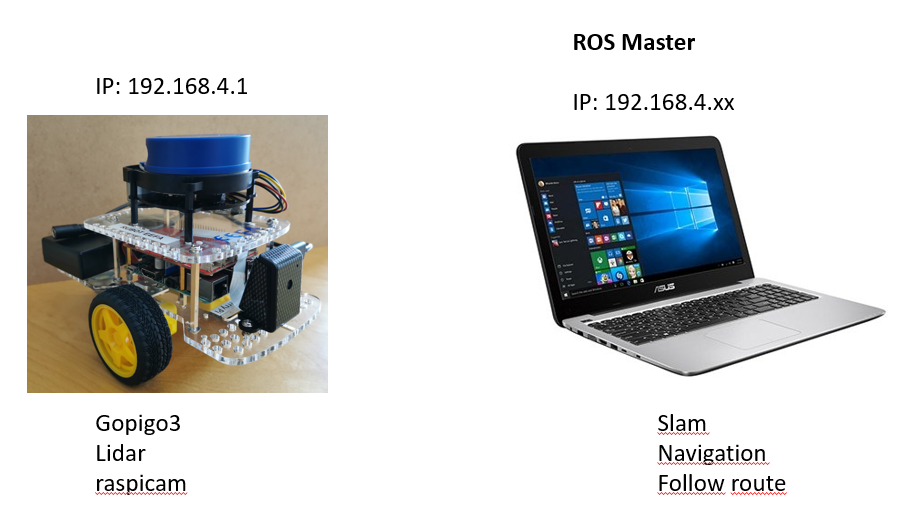
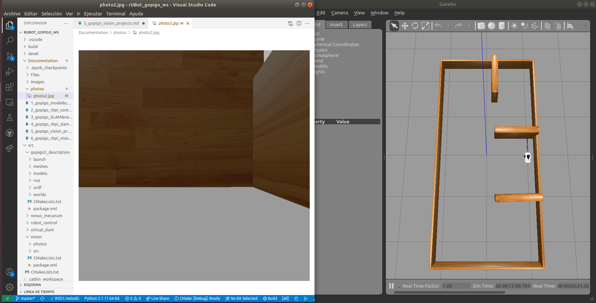

# **gopigo3 challenging projects in raspberrypi3**

The projects proposed will be based on:
1. Image processing
References:
- https://learn.turtlebot.com/
- https://learn.turtlebot.com/2015/02/04/1/
- https://learn.turtlebot.com/2015/02/04/2/
- https://learn.turtlebot.com/2015/02/04/3/
- https://github.com/markwsilliman/turtlebot
- http://wiki.ros.org/Camera%2BDynamixelRobotSample/CameraPictureServer
- https://industrial-training-master.readthedocs.io/en/melodic/_source/session5/OpenCV-in-Python.html

<<<<<<< HEAD
## **Hardware architecture**

To optimize the hardware/software capabilities, we will distribute the ROS nodes between raspberrypi3 and a PC.

- ROS Master will be located on the PC
- In Raspberrypi3 we will launch: gopigo3, lidar and raspicam
- In PC we will launch: slam, navigation and the other project nodes

When different hardware have to communicate in a closed-loop within ROS, is needed:
1. Clock syncronisation has to be ensured. 
    - We have to install chrony in raspberrypi3 and PC
    - define the config with the corresponding IP address
2. Environment variables
    - In PC: open a new terminal and type
    ```shell
    export ROS_IP=192.168.4.xx
    export ROS_MASTER_URI=http://192.168.4.xx:11311
    ```
    - In raspberrypi3: open a new terminal and type
    ```shell
    export ROS_IP=192.168.4.1
    export ROS_MASTER_URI=http://192.168.4.xx:11311
    ```

## **Launch ROS Master in PC**
First of all, copy the "gopigo3_projects" package we have prepared to the "rUBot_gopigo_ws" workspace in /src folder. Compile the workspace with catkin_make.

Now open a new terminal in workspace and lauch roscore:
=======
We will 
Master en pc

en rbpi3:
installar sync
fitxer conf posar ip pc
export master uri: pc

bringup amb camera

en pc:
installar sync
fitxer conf posar ip rbpi
canviar el nom del topic 

roslaunch gopigo3_slam navigation
rosrun gopigo3_projects 

## 1. Take photo using Code:

https://learn.turtlebot.com/2015/02/04/3/

Modify the "take_photo.py" python file with:
- the proper topic name /gopigo/camera1/image_raw
- the proper photo folder path: /media/sf_github_manelpuig/rUBot_gopigo_ws/Documentation/photos/photo1.jpg
>>>>>>> bf64a4b42e0f62ae18f6bf8da81876fda91e87bd
```shell
roscore
```
## **Gopigo3 bringup in raspberrypi3**
You are now ready to launch the different nodes in raspberrypi3 (gopigo3, lidar and raspicam).
- Open a new terminal in raspberrypi3 and type:
```shell
roslaunch gopigo3_control bringup.launch
```

## **Projects execution in PC**
We will now start different nodes corresponding to the different projects we are planning for this section:
- Take a photo
- Go to specific point in the map
- Go to specific point in the map and take a photo

## 1. Take photo using Code:
The objective is to program a python code to take a photo using raspicam in gopigo3 robot prototype.

Important information is taken from: https://learn.turtlebot.com/2015/02/04/3/

Follow the procedure:
- Identify the topic name where raspicam publishes the photo as a mesage of type sensor_msgs. In a new terminal type:
    ```shell
    rostopic list
    ```
- Then modify the "take_photo.py" python file with:
    - the proper topic name /gopigo/camera1/image_raw
    - the proper photo filename in folder path: /media/sf_github_manelpuig/rUBot_gopigo_ws/Documentation/photos/photo1.jpg
- run the "take_photo.py" python file to take a photo
    ```shell
    rosrun gopigo3_projects take_photo.py
    ```
- Open the "photos" folder and you will see the photo1.jpg created



## **2. Go to specific point in the map**

In this project we will learn how to send robot a command: “go to a specific position at map”.

The program is extracted from:
- https://github.com/markwsilliman/turtlebot
- https://learn.turtlebot.com/2015/02/03/11/

Follow the procedure:
- Launch gopigo3_bringup in rbpi3 terminal: (If you have closed it)
    ```shell
    roslaunch gopigo3_control gopigo3_bringup.launch
    ```
- Generate the map of your real world following instructions of lesson 4
- Launch the navigation using the previously generated map:
    ```shell
    roslaunch gopigo3_slam gopigo3_navigation.launch
    ```
- Choose a target point in RVIZ using "Publish point" and select the target coordinates (i.e. x=2.0 y=-0.7)


- open "go_to_specific_point_on_map.py" and specify the target point
    - in line 78 specify the target point, customize the following values so they are appropriate for your location
        - position = {'x': 2.0, 'y' : -0.7}

- Launch the "go_to_specific_point_on_map.py" program:
    ```shell
    rosrun gopigo3_projects go_to_specific_point_on_map.py
    ```

>Carefull!!:
- if the python program is not working, be sure to make "source devel/setup.bash"

## **3. Go to specific point in the map and take a photo**

We will combine our skills from two previous objectives: 
- “Going to a Specific Location on Your Map Using Code” 
- and “Taking a Photo Using Code”. 

The gopigo3 will go from the start to each goal from the list and take a photo in every position.

We have generated  the python file "Follow_the_route2.py" that reads input data from route.yaml file. The YAML file has three lines. It means that there are three goals:

- {filename: './src/gopigo3_projects/photos/room11.png', position: { x: -0.3, y: -0.8}, angle: {fi: -90}}
- {filename: './src/gopigo3_projects/photos/room22.png', position: { x: 1.7, y: -0.7}, angle: {fi: 0}}
- {filename: './src/gopigo3_projects/photos/room33.png', position: { x: 1.7, y: 0.5}, angle: {fi: 0}}

The objective is to follow the route and take pictures. Proceed with the following steps:

- Launch gopigo3_bringup in rbpi3 terminal: (If you have closed it)
    ```shell
    roslaunch gopigo3_control gopigo3_bringup.launch
    ```
- Run the navigation using the previously generated map::
    ```shell
    roslaunch gopigo3_slam gopigo3_navigation.launch
    ```
- Specify a "route2.yaml" file with the desired points to follow and take photo:

- {filename: './src/gopigo3_projects/photos/room11.png', position: { x: -0.3, y: -0.8}, angle: {fi: -90}}
- {filename: './src/gopigo3_projects/photos/room22.png', position: { x: 1.7, y: -0.7}, angle: {fi: 0}}
- {filename: './src/gopigo3_projects/photos/room33.png', position: { x: 1.7, y: 0.5}, angle: {fi: 0}}

- Open a terminal in the "rUBot_gopigo_ws" and launch the "follow_the_route.py" program:
    ```shell
    rosrun gopigo3_projects follow_the_route2.py
    ```

>Careful!: 
Be sure to execute the rosrun instruction inside the "rUBot_gopigo_ws" folder. Review the the absolute path or relative path to the yaml file and the picture path destination.


